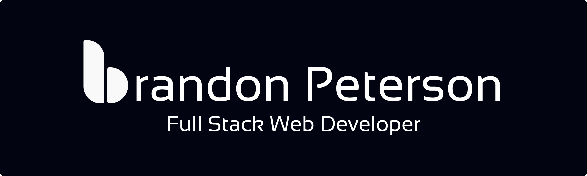

Hey there 👋

I’m Braydon, a senior full-stack engineer, creative coder and self-proclaimed designer who specializes in front-end development. I make it my mission to translate user-focused designs into pixel-perfect websites or applications that run blazing fast.

Want to know more about me? [Check out my portfolio.](https://www.brandonpeterson.dev/)

 
 

## &#x1f4c8; GitHub Stats

 

 
 

## 💼 Skills

